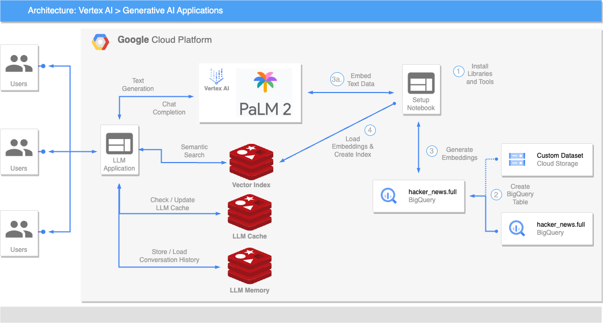

# LLM Reference Architecture using Redis & Google Cloud Platform

## Reference Architecture

## Demo

## Additional Resources
- [DRAFT Blog Post](https://docs.google.com/document/d/1nGelpYQaFcTd1lqLOC3W0ZoXVDNMiI3W3pG7LY4U3n4/edit?usp=sharing)
- [LangChain Example](https://github.com/antonum/Redis-Workshops/blob/main/05-LangChain_Redis/05.3_VertexAI_LangChain_Redis.ipynb)
- [Redis Documentation]()
- [Other Redis Resources]()
- [Google VertexAI Resources]()
- [Google BigQuery Resources]()
