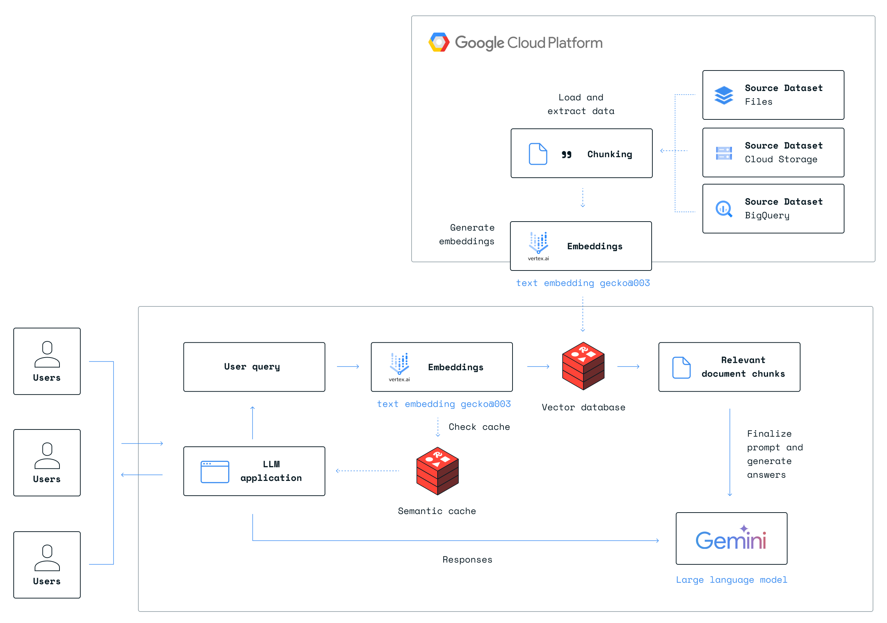

# Scalable LLM Architectures with Redis & GCP Vertex AI

☁️ [Generative AI](https://cloud.google.com/vertex-ai/generative-ai/docs/learn/overview) with Google Vertex AI comes with a specialized [in-console studio experience](https://cloud.google.com/vertex-ai/docs/generative-ai/start/quickstarts/quickstart), a [dedicated API for Gemini](https://cloud.google.com/vertex-ai/docs/generative-ai/start/quickstarts/api-quickstart) and easy-to-use [Python SDK](https://cloud.google.com/vertex-ai/docs/python-sdk/use-vertex-ai-python-sdk) designed for deploying and managing instances of Google's powerful language models.

⚡ Redis Enterprise offers fast and scalable [vector search](https://redis.io/solutions/vector-search/), with an API for index creation, management, blazing-fast search, and hybrid filtering. When coupled with its [versatile data structures](https://redis.io/docs/latest/develop/data-types/) - Redis Enterprise shines as the optimal solution for building high-quality Large Language Model (LLM) apps.

>This repo serves as a foundational architecture for building LLM applications with Redis and GCP services.

## Reference architecture

1. Primary Data Sources
2. Data Extraction and Loading
3. Large Language Models
    - `text-embedding-gecko@003` for embeddings
    - `gemini-1.5-flash-001` for LLM generation and chat
3. High-Performance Data Layer (Redis)
    - Semantic caching to improve LLM performance and associated costs
    - Vector search for context retrieval from knowledge base

## RAG demo

**Open the code tutorial using the Colab notebook to get your hands dirty with Redis and Vertex AI on GCP.** It's a step-by-step walkthrough of setting up the required data, and generating embeddings, and building RAG from scratch in order to build fast LLM apps; highlighting Redis vector search and semantic caching.

## Additional resources
- [Streamlit PDF chatbot example app](examples/chat-your-pdf/)
- [Redis vector search documentation](https://redis.io/docs/latest/develop/interact/search-and-query/query/vector-search/)
- [Get started with RedisVL](https://redis.io/blog/introducing-the-redis-vector-library-for-enhancing-genai-development/)
- [Google VertexAI resources](https://cloud.google.com/vertex-ai)
- [More Redis ai resources](https://github.com/redis-developer)